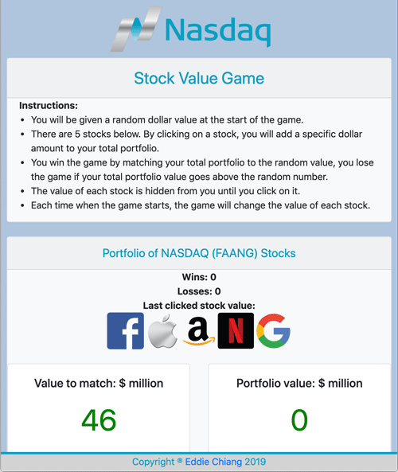

# NASDAQ Stock Value Game
This is a fun and interactive game using JavaScript and jQuery to dynamically update the HTML. Using stock market theme with popular FAANG Stocks (Facebook, Apple, Amazon, Netflix, Google), you can guess the value of each stock and try to match the target value with your stock portfolio.

### Game Interface

Instructions:
* You will be given a random dollar value at the start of the game.
* There are 5 stocks below. By clicking on a stock, you will add a specific dollar amount to your total portfolio.
* You win the game by matching your total portfolio to the random value, you lose the game if your total portfolio value goes above the random number.
* The value of each stock is hidden from you until you click on it.
* Each time when the game starts, the game will change the value of each stock.
* Make sure you turn on your volume to enjoy the full sound effect.

Click on the link to play!
https://echiang73.github.io/unit-4-game/

### Built with
* HTML5
* CSS3
* JavaScript
* Bootstrap
* jQuery

Here's a preview of the game:

